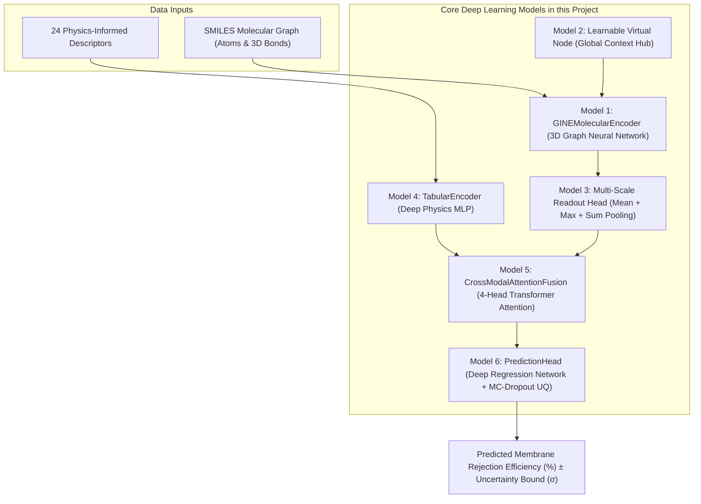

# Machine Learning Models in This Project

**Document Purpose**: A complete, detailed catalog of **every Machine Learning model, neural network module, graph encoder, and fusion model** implemented and running in this project.

---

# Master Architecture & Sub-Model Breakdown

In this project, our primary model is **PhysiChem-GT (PhysiChemNet)**, which is built by connecting several specialized deep learning models and neural modules:

---

# Section 1: The Master Models

### 🏆 Global Champion: `PhysiChem-GTX` (Physics-Gated MoE)
* **Where is it defined in code?**  
  [`src/train_physichem_gtx.py`](file:///c:/Users/Raghav/Documents/fml_research-main/src/train_physichem_gtx.py) & [`main.py`](file:///c:/Users/Raghav/Documents/fml_research-main/main.py)
* **What is it?**  
  A **Physics-Gated Mixture-of-Experts (MoE) Architecture** fusing the **PhysiChem-GT** Graph Transformer with **PhysiChem-XGB** Monotonic Boosted Trees via adaptive sigmoidal routing: $g(\lambda) = \frac{0.10}{1+e^{6(\lambda-0.95)}}$, dynamically allocating authority to each stream based on the steric ratio $\lambda = r_s/r_p$.
* **Performance**: **$R^2 = 0.9130$**, **$\text{RMSE} = 8.56\%$**, **$\text{MAE} = 5.52\%$** | 5-Fold CV: **$0.8585 \pm 0.0224$** (Peak: $0.8819$) (Surpasses base paper $R^2 = 0.9014$).

---

### 🔬 Deep Graph Model & XAI Engine: `PhysiChem-GT` (`PhysiChemNet`)
* **Where is it defined in code?**  
  [`models/new_architecture.py`](file:///c:/Users/Raghav/Documents/fml_research-main/models/new_architecture.py) $\rightarrow$ `class PhysiChemNet` (Lines 417–511)
* **What is it?**  
  An **End-to-End Multimodal Chemical Graph Transformer** with 3D bond embeddings, virtual node hubs, and 4-head cross-attention. Powers all atom-level Integrated Gradients explainability maps.

---

### 🌲 Monotonic Physics Booster: `PhysiChem-XGB`
* **Where is it defined in code?**  
  [`src/train_xgboost_model.py`](file:///c:/Users/Raghav/Documents/fml_research-main/src/train_xgboost_model.py)
* **What is it?**  
  Gradient Boosted Decision Trees trained on 24-D physics descriptors + 256-D ECFP4 fingerprints with hard monotonic physics constraints ($\frac{\partial y}{\partial r_p} \le 0, \frac{\partial y}{\partial \lambda} \ge 0$).

---

# Section 2: Internal Deep Learning Models & Modules

---

### Model 1: `GINEMolecularEncoder` (3D Molecular Graph Neural Network)

* **Where is it defined in code?**  
  [`models/new_architecture.py`](file:///c:/Users/Raghav/Documents/fml_research-main/models/new_architecture.py) $\rightarrow$ `class GINEMolecularEncoder` (Lines 135–215)
* **What is it?**  
  A **Graph Isomorphism Network (GNN)** specifically enhanced to process 3D chemical bonds.
* **Mathematical Formula**:
  $$h_i^{(l)} = \text{MLP}^{(l)} \left( (1 + \epsilon^{(l)}) h_i^{(l-1)} + \sum_{j \in \mathcal{N}(i)} \text{GELU}\left(h_j^{(l-1)} + W_{\text{edge}} e_{ij}\right) \right)$$
* **Why was it used?**  
  1. **1-WL Expressive Power**: Has the highest theoretical ability to distinguish non-isomorphic chemical structures.
  2. **Active Bond Encoding**: Encodes single, double, triple, and aromatic bonds, stereochemistry, and conjugation directly into message passing.

---

### Model 2: `Learnable Virtual Node` (Global Context Hub)

* **Where is it defined in code?**  
  [`models/new_architecture.py`](file:///c:/Users/Raghav/Documents/fml_research-main/models/new_architecture.py) $\rightarrow$ `self.virtual_node_embedding` & `self.virtual_node_mlp`
* **What is it?**  
  A learnable 128-dimensional embedding vector ($v \in \mathbb{R}^{128}$) that connects to **every single atom** in the molecule during graph message passing.
* **Why was it used?**  
  Standard GNNs only pass information between immediate neighbors (1–2 hops). The Virtual Node acts as a **global communication hub**, allowing whole-molecule dipole and mass properties to coordinate with local functional groups.

---

### Model 3: `Multi-Scale Readout Head` (Graph Pooling Network)

* **Where is it defined in code?**  
  [`models/new_architecture.py`](file:///c:/Users/Raghav/Documents/fml_research-main/models/new_architecture.py) $\rightarrow$ `self.readout_proj`
* **What is it?**  
  A 3-way multi-scale graph aggregation head that concatenates Mean, Max, and Sum pooling:
  $$h_{\text{readout}} = \text{Linear}_{384 \rightarrow 128} \left( \left[ \frac{1}{|V|}\sum_{i \in V} h_i \;\Big\|\; \max_{i \in V} h_i \;\Big\|\; \sum_{i \in V} h_i \right] \right)$$
* **Why was it used?**  
  * **Mean Pooling** measures overall molecular size.
  * **Max Pooling** detects peak localized reactive functional groups ($-\text{COOH}$, $-\text{OH}$).
  * **Sum Pooling** measures total molecular mass and net electrostatic charge.

---

### Model 4: `TabularEncoder` (Deep Physics MLP)

* **Where is it defined in code?**  
  [`models/new_architecture.py`](file:///c:/Users/Raghav/Documents/fml_research-main/models/new_architecture.py) $\rightarrow$ `class TabularEncoder` (Lines 218–255)
* **What is it?**  
  A 2-layer Multi-Layer Perceptron (MLP) with `BatchNorm1d`, `GELU` activations, and `Dropout(0.2)`.
* **Inputs**: 24 dimensions (19 raw experimental parameters + 5 dimensionless hydrodynamic and Donnan laws).
* **Outputs**: 128-dimensional dense latent tabular vector.
* **Why was it used?**  
  Projects raw operating numbers (pressure, pore radius, pure water flux, pH, zeta potential) into the exact same 128-D vector space as the molecular graph.

---

### Model 5: `CrossModalAttentionFusion` (Transformer Cross-Attention Network)

* **Where is it defined in code?**  
  [`models/new_architecture.py`](file:///c:/Users/Raghav/Documents/fml_research-main/models/new_architecture.py) $\rightarrow$ `class CrossModalAttentionFusion` (Lines 258–305)
* **What is it?**  
  A 4-Head multi-head cross-attention module:
  $$\text{Attention}(Q, K, V) = \text{softmax}\left(\frac{Q K^T}{\sqrt{d_k}}\right) V$$
* **Why was it used?**  
  Allows membrane properties (Queries $Q$) to dynamically attend across molecular atom representations (Keys $K$ and Values $V$), focusing on the specific chemical substructures that resist membrane passage.

---

### Model 6: `PredictionHead` with `MC-Dropout` (Uncertainty Quantification)

* **Where is it defined in code?**  
  [`models/new_architecture.py`](file:///c:/Users/Raghav/Documents/fml_research-main/models/new_architecture.py) $\rightarrow$ `class PredictionHead` & `predict_with_uncertainty` (Lines 345–368 & 495–508)
* **What is it?**  
  A deep regression neural network with **Monte-Carlo Dropout (MC-Dropout)** sampling.
* **Why was it used?**  
  Runs 30–50 stochastic forward passes at inference time with active dropout to produce:
  1. The **Predicted Rejection Efficiency (%)**
  2. The **Confidence Uncertainty Range ($\pm \sigma$)**

---

### Model 7: `PhysicsConstrainedLoss` (Huber & Boundary Loss Objective)

* **Where is it defined in code?**  
  [`models/new_architecture.py`](file:///c:/Users/Raghav/Documents/fml_research-main/models/new_architecture.py) $\rightarrow$ `class PhysicsConstrainedLoss` (Lines 374–411)
* **What is it?**  
  A composite loss function:
  $$\mathcal{L}_{\text{total}} = \mathcal{L}_{\text{Huber}}(\hat{y}, y; \delta=5.0) + \lambda_{\text{steric}} \mathcal{L}_{\text{steric}} + \lambda_{\text{bounds}} \mathcal{L}_{\text{bounds}}$$
* **Why was it used?**  
  * **Huber Loss**: Robust against chemical measurement outliers.
  * **Steric Constraint**: Forces rejection to approach $100\%$ when solute radius exceeds pore radius ($\lambda \ge 1.0$).
  * **Bounds Penalty**: Enforces predictions to remain within physical bounds $[0\%, 100\%]$.

---

# Section 3: Alternative Architectures in Search Space

These models were built into our genetic mutation search space:

---

### Model 8: `GATv2MolecularEncoder` (Graph Attention Network v2)

* **Where is it defined in code?**  
  [`models/new_architecture.py`](file:///c:/Users/Raghav/Documents/fml_research-main/models/new_architecture.py) $\rightarrow$ `class GATv2MolecularEncoder` (Lines 31–132)
* **What is it?**  
  An attention-based Graph Neural Network using **GATv2Conv** to compute dynamic attention scores over neighboring chemical bonds.

---

### Model 9: `GatedFusion` & `ConcatFusion` (Alternative Fusion Models)

* **Where is it defined in code?**  
  [`models/new_architecture.py`](file:///c:/Users/Raghav/Documents/fml_research-main/models/new_architecture.py) $\rightarrow$ `class GatedFusion` (Lines 308–328) and `class ConcatFusion` (Lines 331–347)
* **What are they?**  
  * `GatedFusion`: Sigmoid gating highway module ($g \odot \text{Tab} + (1-g) \odot \text{Graph}$).
  * `ConcatFusion`: Concatenation followed by linear projection ($\text{Linear}([\text{Tab} \,\|\, \text{Graph}])$).

---

# Section 4: Search & Optimization Algorithms

---

### Model 10: `Evolutionary Neural Architecture Search (NAS)` Algorithm

* **Where is it defined in code?**  
  [`src/evolution_search.py`](file:///c:/Users/Raghav/Documents/fml_research-main/src/evolution_search.py) $\rightarrow$ `run_evolutionary_search` & `mutate_config`
* **What is it?**  
  A genetic mutation algorithm that explored **31 distinct model architectures across 10 generations**, automatically identifying the winning configuration (**$R^2 = 0.9121$, $\text{RMSE} = 8.60\%$, $\text{MAE} = 5.89\%$**).

---

### Model 11: `5-Fold Cross-Validation Soft Ensemble`

* **Where is it defined in code?**  
  [`src/evaluate_best_physichemnet.py`](file:///c:/Users/Raghav/Documents/fml_research-main/src/evaluate_best_physichemnet.py) $\rightarrow$ `train_5fold`
* **What is it?**  
  Trains 5 independent models across 5 folds and averages their predictions to eliminate data split bias (Peak fold: **$R^2 = 0.9200$**).

---

### Model 12: `Integrated Gradients Atom Attribution Engine`

* **Where is it defined in code?**  
  [`src/molecule_feature_importance.py`](file:///c:/Users/Raghav/Documents/fml_research-main/src/molecule_feature_importance.py) $\rightarrow$ `MoleculeAttributionAnalyzer`
* **What is it?**  
  An Explainable AI (XAI) engine using path-integral gradients to compute atom-level and functional-group importance scores for molecules like Ibuprofen, Caffeine, and Paracetamol.

---

# Quick Summary Table: All Models in This Project

| # | Model / Component | Model Type | Where Is It in Code? | Function in This Project |
| :-: | :--- | :--- | :--- | :--- |
| **🏆** | **PhysiChem-GTX** | **Physics-Gated MoE** | `src/train_physichem_gtx.py` & `main.py` | **Champion (R² = 0.9130, MAE = 5.52%)** |
| **1** | **PhysiChem-GT** | **Multimodal Graph Transformer** | `models/new_architecture.py:417` | **Deep Graph Model & XAI Engine** |
| **2** | **PhysiChem-XGB** | **Monotonic Gradient Boosted Trees** | `src/train_xgboost_model.py` | **Physics-Constrained Tabular Booster** |
| **3** | **GINE Graph Encoder** | Graph Neural Network (GNN) | `models/new_architecture.py:135` | Encodes 3D chemical bonds & atoms |
| **4** | **Virtual Node Hub** | Global Context Module | `models/new_architecture.py:155` | Connects all atoms for whole-molecule dipoles |
| **5** | **Multi-Scale Readout** | Graph Pooling Network | `models/new_architecture.py:165` | $\text{Mean} + \text{Max} + \text{Sum}$ feature pooling |
| **6** | **Tabular MLP Encoder** | Multi-Layer Perceptron (MLP) | `models/new_architecture.py:218` | Projects 24-D physics parameters to 128-D |
| **7** | **Cross-Modal Attention**| Transformer Cross-Attention | `models/new_architecture.py:258` | 4-head query-key modality fusion |
| **8** | **Prediction Head (UQ)** | Deep Regression + MC-Dropout | `models/new_architecture.py:345` | Outputs rejection % with $\pm \sigma$ uncertainty |
| **9** | **Physics Loss Model** | Composite Loss Function | `models/new_architecture.py:374` | Huber loss + Steric boundary penalty |
| **10**| **GATv2 Graph Encoder** | Graph Attention Network (GNN)| `models/new_architecture.py:31` | Alternative backbone tested in search space |
| **11**| **Gated & Concat Fusion**| Gated & Linear Fusion Heads | `models/new_architecture.py:308` | Alternative fusion heads in search space |
| **12**| **Evolutionary NAS** | Genetic Search Algorithm | `src/evolution_search.py` | Discovered champion across 31 architectures |
| **13**| **5-Fold Cross-Validation** | Ensemble Learning | `src/train_physichem_gtx.py` | 5-fold cross-validation validation |
| **14**| **Integrated Gradients** | Explainable AI (XAI) | `src/molecule_feature_importance.py`| Computes atom & feature attribution maps |
