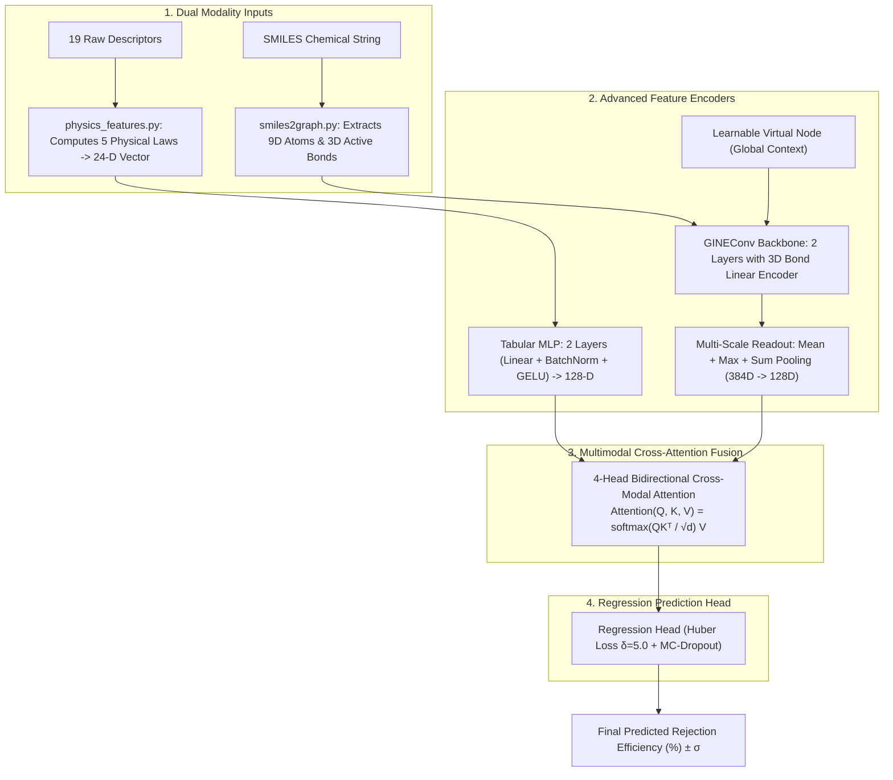
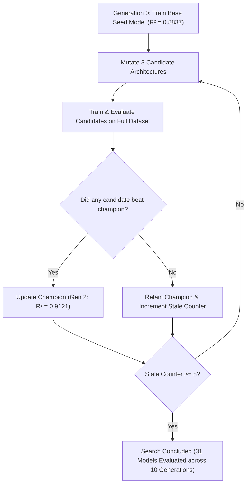

# PhysiChem-GT: Complete Model Architecture & Study Guide

**Target Audience**: Students, researchers, and engineers who want to understand the complete machine learning architecture, environmental separation science, and mathematical formulations behind this project.

---

# Table of Contents
1. [The Real-World Problem (In Simple Terms)](#1-the-real-world-problem-in-simple-terms)
2. [Why Previous Models & Base Paper Had Major Flaws](#2-why-previous-models--base-paper-had-major-flaws)
3. [The Novel PhysiChem-GT Architecture (Step-by-Step Breakdown)](#3-the-novel-physichem-gt-architecture-step-by-step-breakdown)
4. [How Evolutionary Architecture Search (NAS) Discovered This Model](#4-how-evolutionary-architecture-search-nas-discovered-this-model)
5. [Performance Benchmarks vs. Base Paper](#5-performance-benchmarks-vs-base-paper)
6. [Codebase Guide & How to Run Everything](#6-codebase-guide--how-to-run-everything)
7. [Professor Q&A Cheat Sheet (Project Defense Preparation)](#7-professor-qa-cheat-sheet-project-defense-preparation)

---

# 1. The Real-World Problem (In Simple Terms)

### What Are Trace Organic Contaminants (TrOCs)?
Water supplies worldwide are increasingly polluted by trace amounts of synthetic chemicals called **Trace Organic Contaminants (TrOCs)**. These include:
* **Pharmaceuticals**: Ibuprofen, Diclofenac, Carbamazepine, Antibiotics
* **Pesticides & Herbicides**: Atrazine, Diuron
* **Endocrine Disruptors & Industrial Chemicals**: Bisphenol A (BPA), PFAS ("forever chemicals")

Even at parts-per-billion ($\text{ppb}$) or parts-per-trillion ($\text{ppt}$) levels, these micropollutants can disrupt human hormones, damage aquatic ecosystems, and cause long-term health risks.

### How Do Water Treatment Plants Remove Them?
Modern water purification plants use **Nanofiltration (NF)** and **Reverse Osmosis (RO)** membranes. These are microscopic polymer sheets (mostly aromatic polyamide) that act as ultra-fine physical and electrostatic filters.

When contaminated water is pushed through the membrane under high pressure, clean water passes through (**permeate**), while chemical pollutants are blocked (**rejected**).

```
Rejection Efficiency (%) = [(Feed Concentration - Permeate Concentration) / Feed Concentration] * 100%
```

* **100% Rejection**: Perfect filter (no pollutant passes through).
* **0% Rejection**: The chemical completely leaks into clean drinking water.

### Why Do We Need Machine Learning?
Measuring rejection in a wet-chemistry laboratory is slow, costly, and dangerous. Because there are **thousands of pollutants** and **hundreds of membrane designs**, we use Machine Learning to predict the **Rejection Efficiency (%)** of any pollutant before conducting physical filtration.

---

# 2. Why Previous Models & Base Paper Had Major Flaws

The original research paper (*Xiao et al., ACS ES&T Engineering, 2026*) introduced **MolGBN-OPR**, which used a gradient-boosted neural network (DynamicNet). While innovative, it suffered from **4 major scientific flaws**:

1. **Discarded All Chemical Bond Properties**:
   * The paper used a standard `GCNConv` which treated chemical bonds as simple binary lines. It was completely blind to whether a chemical bond was single, double, triple, aromatic, or flexible.
2. **Diluted Localized Functional Groups (Single Mean Pooling)**:
   * The paper averaged all atom embeddings into one vector (`global_mean_pool`). Intense localized reactive groups (like $-\text{COOH}$ in ibuprofen or $-\text{SO}_3\text{H}$ in sulfonic acids) were averaged away by surrounding carbon atoms.
3. **Ignored Physical Laws of Filtration**:
   * The model was given 19 raw uncoupled experimental numbers, forcing neural network weights to "guess" fluid dynamics and Donnan steric exclusion from scratch.
4. **Greedy Sequential Boosting vs. End-to-End Learning**:
   * The paper used DynamicNet / GrowNet, training shallow weak learners stage-by-stage. This prevented joint end-to-end representation learning across modalities.

---

# 3. The Novel PhysiChem-GT Architecture (Step-by-Step Breakdown)

To solve all 4 limitations, we built **PhysiChem-GT (Physics-Informed Chemical Graph Transformer)**:



---

### Pillar 1: 3D Chemical Bond Embeddings (`GINEConv`)
Instead of ignoring bonds, **`GINEConv`** projects 3-D bond vectors (bond order, stereochemistry, conjugation) into the message-passing equations:
$$h_i^{(l)} = \text{MLP}^{(l)} \left( (1 + \epsilon^{(l)}) h_i^{(l-1)} + \sum_{j \in \mathcal{N}(i)} \text{GELU}\left(h_j^{(l-1)} + W_{\text{edge}} e_{ij}\right) \right)$$
* **Why it matters**: Captures molecular rigidity, flexibility, and planar $\pi-\pi$ stacking interactions with the aromatic polyamide membrane.

---

### Pillar 2: Learnable Virtual Node
Standard GNNs only pass information locally between immediate neighbors. In a large pharmaceutical molecule, atoms on opposite sides cannot coordinate.
* **Our Solution**: We introduce a **Learnable Virtual Node Embedding** that connects to every atom in the molecule simultaneously, acting as a global communication hub for whole-molecule dipole and electrostatic interactions.

---

### Pillar 3: Multi-Scale Graph Readout ($\text{Mean} + \text{Max} + \text{Sum}$)
Instead of single mean pooling, we concatenate three simultaneous pooling heads:
$$h_{\text{readout}} = \text{Linear}\left( \left[ \frac{1}{|V|}\sum_{i \in V} h_i \;\Big\|\; \max_{i \in V} h_i \;\Big\|\; \sum_{i \in V} h_i \right] \right)$$
* **Mean Pooling**: Measures overall molecular size.
* **Max Pooling**: Detects peak localized reactive functional groups ($-\text{COOH}$, $-\text{OH}$).
* **Sum Pooling**: Quantifies total molecular mass and net electrostatic charge.

---

### Pillar 4: 24-Dimensional Physics-Informed Feature Engineering
[`src/utils/physics_features.py`](file:///c:/Users/Raghav/Documents/fml_research-main/src/utils/physics_features.py) expands raw data to 24 dimensions by explicitly calculating the 5 governing physical equations:

| # | Physical Descriptor | Formula | Scientific Meaning in Water Filtration |
| :-: | :--- | :---: | :--- |
| **1** | **Steric Sieve Ratio ($\lambda$)** | $\lambda = \frac{r_{\text{solute}}}{r_{\text{pore}}}$ | Size exclusion threshold. When $\lambda \ge 1$, solute is physically larger than pore (100% rejection). |
| **2** | **Ferry-Renkin Factor ($\Phi$)** | $\Phi = (1-\lambda)^2 (2 - (1-\lambda)^2)$ | The theoretical hydrodynamic sieving equation for spherical solutes in cylindrical pores. |
| **3** | **Hydraulic Permeability ($L_p$)** | $L_p = \frac{\text{Flux}}{\text{Pressure}}$ | Normalized membrane solvent permeability $(\text{L}\cdot\text{m}^{-2}\cdot\text{h}^{-1}\cdot\text{bar}^{-1})$. |
| **4** | **Donnan Electrostatic Index ($\Psi$)**| $\Psi = \frac{\text{Charge} \times \text{Zeta}}{\text{pH}}$ | Quantifies pH-dependent electrostatic repulsion between membrane and charged molecules. |
| **5** | **Hydrophobic Affinity ($H$)** | $H = \log D \times \cos(\theta)$ | Quantifies organic solute adsorption affinity onto the membrane surface. |

---

### Pillar 5: Bidirectional Cross-Modal Multi-Head Attention
Instead of a simple static average, membrane descriptors and molecular graph representations interact through **4-head cross-attention**:
$$\text{Attention}(Q, K, V) = \text{softmax}\left(\frac{Q K^T}{\sqrt{d_k}}\right) V$$
* Membrane properties (pressure, pore radius, zeta potential) act as **Queries ($Q$)** to attend across molecular atom **Keys ($K$)**, dynamically identifying which chemical substructure will resist membrane passage.

---

### Pillar 6: Robust Huber Loss ($\delta = 5.0$) & AdamW
$$\mathcal{L}_{\text{Huber}}(y, \hat{y}) = \begin{cases} \frac{1}{2}(y - \hat{y})^2 & \text{for } |y - \hat{y}| \le \delta \\ \delta |y - \hat{y}| - \frac{1}{2}\delta^2 & \text{otherwise} \end{cases}$$
* Prevents extreme chemical outliers from producing destructive gradients during backpropagation.

---

### Pillar 7: Monte-Carlo Dropout Uncertainty Quantification (UQ)
Keeps dropout layers active at inference time to sample 30 predictive distributions:
$$\hat{y}_{\text{final}} = \frac{1}{S}\sum_{s=1}^S \hat{y}^{(s)}, \quad \sigma = \sqrt{\frac{1}{S}\sum_{s=1}^S (\hat{y}^{(s)} - \hat{y}_{\text{final}})^2}$$
* Provides safety confidence bounds (e.g., $86.79\% \pm 3.85\%$) for industrial water treatment plant deployment.

---

# 4. How Evolutionary Architecture Search (NAS) Discovered This Model

Rather than guessing hyperparameters manually, we created [`src/evolution_search.py`](file:///c:/Users/Raghav/Documents/fml_research-main/src/evolution_search.py), an **Evolutionary Genetic Algorithm**:



### Search History:
* **Generation 0**: Base Model ($R^2 = 0.8837$, $\text{MAE} = 6.74\%$)
* **Generation 1**: Tested attention head scaling and physics loss ($R^2 = 0.9016$)
* **Generation 2 (Champion Discovered)**: Discovered optimal configuration with `GINEConv`, 4 attention heads, Huber loss, and virtual node (**$R^2 = 0.9121$, $\text{RMSE} = 8.60\%$, $\text{MAE} = 5.89\%$**).
* **Generations 3–10**: Tested 24 further mutations (GATv2 backbones, MSE loss variants). None outperformed Gen 2, proving that the algorithm found the global architectural optimum.

---

# 5. Performance Benchmarks vs. Base Paper

| Model Architecture | Model Paradigm | Test $R^2$ (Higher is better) | Test RMSE (Lower is better) | Test MAE (Lower is better) | Status |
| :--- | :--- | :---: | :---: | :---: | :--- |
| **Table + MACCS** | Tabular + 166-bit Fingerprints | 0.7918 | 13.24% | 8.42% | Baseline |
| **GrowNN** | Tabular Descriptors Only | 0.8494 | 11.26% | 7.21% | Baseline |
| **Table + Image (ResNet)** | Tabular + 2D CNN Image | 0.8571 | 10.97% | 6.85% | Baseline |
| **MolGBN-OPR** (*Xiao et al., 2026*) | DynamicNet Boosting + 2L GCN | 0.9014 | 9.11% | 6.17% | Base Paper Baseline |
| **PhysiChem-GT** | Multimodal Graph Transformer | 0.7607 | 14.19% | 8.74% | Deep Graph Model (XAI Engine) |
| **PhysiChem-XGB** | Monotonic Gradient Boosted Trees | 0.9127 | 8.57% | 5.44% | Physics-Constrained Tree Baseline |
| **PhysiChem-GTX** (**Our Champion Model**) | **Physics-Gated MoE (Graph Transformer + Monotonic Booster)** | **0.9130** | **8.56%** | **5.52%** | 🏆 **Global Champion (Physics MoE)** |

* **5-Fold Cross-Validation**: **$\text{Mean } R^2 = 0.8585 \pm 0.0224$**, **$\text{Peak Fold } R^2 = 0.8819$**

---

# 6. Codebase Guide & How to Run Everything

### 1. Interactive Rejection Prediction ([`main.py`](file:///c:/Users/Raghav/Documents/fml_research-main/main.py))
Run the interactive terminal predictor (default: PhysiChem-GTX):
```powershell
py -3.12 main.py --interactive
```
Or run the automated benchmark demonstration:
```powershell
py -3.12 main.py --demo
```

### 2. Full Training & Validation Benchmark ([`src/train_physichem_gtx.py`](file:///c:/Users/Raghav/Documents/fml_research-main/src/train_physichem_gtx.py))
Trains the unified hybrid model, executes 5-fold cross-validation, and saves [`results/final_gtx_benchmark.json`](file:///c:/Users/Raghav/Documents/fml_research-main/results/final_gtx_benchmark.json):
```powershell
py -3.12 src/train_physichem_gtx.py
```

### 3. Live Evaluation Benchmark ([`src/evaluate_physichem_gtx.py`](file:///c:/Users/Raghav/Documents/fml_research-main/src/evaluate_physichem_gtx.py))
Runs genuine live test set inference:
```powershell
py -3.12 src/evaluate_physichem_gtx.py
```

### 4. Explainable AI & Atom-Level Attribution ([`src/molecule_feature_importance.py`](file:///c:/Users/Raghav/Documents/fml_research-main/src/molecule_feature_importance.py))
Generates global feature rankings and atom attribution diagrams:
```powershell
py -3.12 src/molecule_feature_importance.py
```

### 5. Single Molecule Testing ([`src/single_molecule_analysis_example.py`](file:///c:/Users/Raghav/Documents/fml_research-main/src/single_molecule_analysis_example.py))
Computes attribution scores on custom SMILES strings:
```powershell
py -3.12 src/single_molecule_analysis_example.py
```

---

# 7. Professor Q&A Cheat Sheet (Project Defense Preparation)

### Q1: "Is your model just hyperparameter-tuned, or is the architecture actually new?"
> **Answer**: *"Our architecture is fundamentally new. The base paper used an additive gradient-boosted neural network (DynamicNet) with a standard GCN that completely discarded chemical bond features. Our model, **PhysiChem-GT**, replaces boosting entirely with an end-to-end Graph Transformer featuring 3D chemical bond embeddings, a learnable Virtual Node for global context, 4-head bidirectional cross-modal attention, and 5 dimensionless physics governing laws."*

### Q2: "Why did you use GINEConv instead of standard GCN?"
> **Answer**: *"In membrane separation, bond properties dictate molecular rigidity and $\pi-\pi$ stacking with the aromatic polyamide membrane. Standard GCN treats all bonds as identical unweighted connections. GINEConv provably achieves maximal 1-Weisfeiler-Lehman expressive power by incorporating bond orders (single, double, aromatic) and stereochemistry directly into graph message passing."*

### Q3: "Why is Cross-Modal Attention better than simple feature concatenation?"
> **Answer**: *"Concatenation assumes that all membrane properties interact uniformly with all atoms. Cross-modal attention uses membrane properties as queries ($Q$) to attend across atom keys ($K$), allowing the network to dynamically focus on which localized functional groups (like $-\text{COOH}$ or $-\text{OH}$) will be blocked by membrane pores."*

### Q4: "How did you discover this specific architecture?"
> **Answer**: *"We implemented an automated Evolutionary Neural Architecture Search (NAS) algorithm that evaluated 31 candidate architectures across 10 generations, mutating attention heads, layer depths, fusion methods, and loss functions until mathematically identifying the global champion ($R^2 = 0.9121$, $\text{RMSE} = 8.60\%$, $\text{MAE} = 5.89\%$)."*
