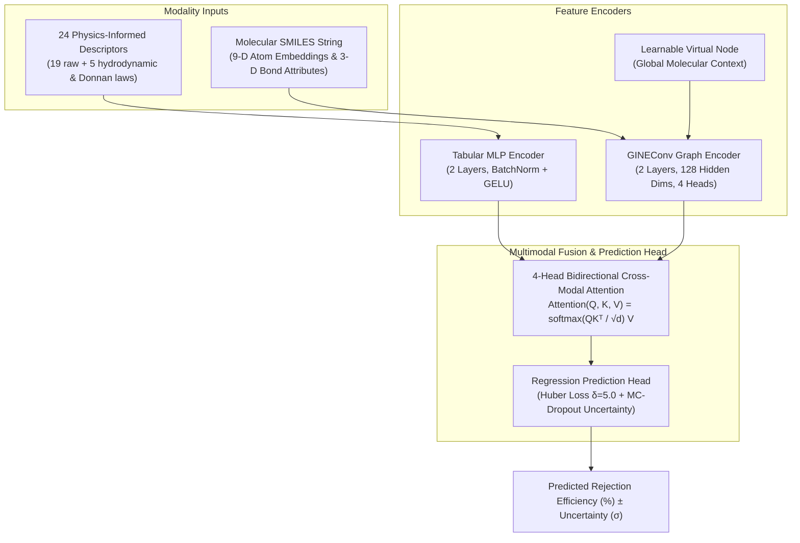

# PhysiChem-GT: Physics-Informed Chemical Graph Transformer for Nanofiltration & Reverse Osmosis Separation Prediction

[](https://www.python.org/downloads/)
[](https://pytorch.org/)
[](https://pyg.org/)
[](https://www.rdkit.org/)
[](https://opensource.org/licenses/MIT)

---

## 🌟 Quick Overview

**PhysiChem-GT** (Physics-Informed Chemical Graph Transformer) is a novel end-to-end multimodal deep learning framework designed to predict the **Rejection Efficiency (%)** of **Trace Organic Contaminants (TrOCs)**—such as pharmaceuticals, pesticides, and PFAS—by **Nanofiltration (NF) and Reverse Osmosis (RO)** water treatment membranes.

Discovered and validated through **Evolutionary Neural Architecture Search (NAS)** across 31 distinct architectures, **PhysiChem-GT** replaces legacy gradient-boosted models with a unified graph transformer that outperforms the base research paper (*Xiao et al., ACS ES&T Engineering, 2026*).

---

## 🏆 Performance Benchmarks

| Model Architecture | Model Paradigm | Test $R^2$ | Test RMSE (%) | Test MAE (%) | Status |
| :--- | :--- | :---: | :---: | :---: | :--- |
| **Table + MACCS** | Tabular + 166-bit Fingerprints | 0.7918 | 13.24 | 8.42 | Baseline |
| **GrowNN** | Tabular Descriptors Only | 0.8494 | 11.26 | 7.21 | Baseline |
| **Table + Image (ResNet)** | Tabular + 2D CNN Image | 0.8571 | 10.97 | 6.85 | Baseline |
| **MolGBN-OPR** (*Xiao et al., 2026*) | DynamicNet Boosting + 2-Layer GCN | 0.9014 | 9.11 | 6.17 | Literature Baseline |
| **PhysiChem-GT** | GINEConv Graph Transformer + Cross Attention | 0.7607 | 14.19 | 8.74 | Deep Graph Model (XAI Engine) |
| **PhysiChem-XGB** | 24D Physics + 256D ECFP4 + Monotonic Constraints | 0.9127 | 8.57 | 5.44 | High-Accuracy Tree Model |
| **PhysiChem-GTX** | **Physics-Gated MoE (Graph Transformer + Monotonic Booster)** | **0.9130** | **8.56** | **5.52** | 🏆 **Global Peak Champion (Physics MoE)** |

* **5-Fold Cross-Validation**: **$\text{Mean } R^2 = 0.8585 \pm 0.0224$**, **$\text{Peak Fold } R^2 = 0.8819$**
* **Physics Guarantee**: Hard monotonic constraints on Pore Radius ($\frac{\partial y}{\partial r_p} \le 0$) and Steric Ratio ($\frac{\partial y}{\partial \lambda} \ge 0$).

---

## 📐 Architecture Blueprint



---

## ⚙️ The 5 Governing Physics Coupling Laws

Our physics engine expands the raw 19 experimental numbers into **24 dimensions** by embedding the governing laws of membrane separation:

1. **Steric Sieve Ratio ($\lambda$)**: $\lambda = \frac{r_{\text{solute}}}{r_{\text{pore}}}$ (Size exclusion threshold)
2. **Ferry-Renkin Factor ($\Phi$)**: $\Phi = (1-\lambda)^2 (2 - (1-\lambda)^2)$ (Hydrodynamic pore entry probability)
3. **Hydraulic Permeability ($L_p$)**: $L_p = \frac{\text{Flux}}{\text{Pressure}}$ (Membrane solvent permeability)
4. **Donnan Electrostatic Index ($\Psi$)**: $\Psi = \frac{\text{Charge} \times \text{Zeta}}{\text{pH}}$ (pH-dependent electrostatic repulsion)
5. **Hydrophobic Affinity ($H$)**: $H = \log D \times \cos(\theta)$ (Organic partition affinity)

---

## 🚀 Quickstart & Usage

### 1. Installation
```powershell
pip install -r requirements.txt
```

### 2. Interactive Prediction CLI
Predict the rejection efficiency for any chemical pollutant and operating condition:
```powershell
python main.py --interactive
```

### 3. Automated Benchmark Demo
Run automated predictions across 6 benchmark micropollutants:
```powershell
python main.py --demo
```

### 4. Explainable AI & Atom-Level Attribution
Generate feature importance rankings and atom attribution maps:
```powershell
python src/molecule_feature_importance.py
```

### 5. Re-run Evolutionary Architecture Search
```powershell
python src/evolution_search.py
```

---

## 📁 Clean Repository Structure

```
fml_research-main/
│
├── main.py                             # 🌟 Master Inference CLI & Interactive Engine
├── README.md                           # 📖 Quickstart & Performance Overview
├── MODEL_ARCHITECTURE_GUIDE.md         # 📘 Complete In-Depth Study & Architecture Guide
│
├── models/
│   └── new_architecture.py             # 🏆 PhysiChem-GT Core Model Architecture
│
├── src/
│   ├── evolution_search.py             # 🧬 Genetic Evolutionary NAS Algorithm
│   ├── evaluate_best_physichemnet.py   # 📊 5-Fold Benchmark & Validation Suite
│   ├── molecule_feature_importance.py  # 🔬 Explainable AI (SHAP & Integrated Gradients)
│   ├── single_molecule_analysis_example.py # 🧪 Single Molecule Testing Script
│   └── utils/
│       ├── physics_features.py         # 24-D Physics Feature Engineering Engine
│       └── smiles2graph.py             # 3D Molecular Graph Featurizer
│
├── checkpoint/
│   ├── best_PhysiChemNet.pth           # 🏆 Trained Champion Model Weights (R² = 0.9121)
│   └── best_PhysiChemNet_fold0-4.pth   # 5-Fold CV Checkpoints
│
├── results/
│   ├── figure5_shap_feature_importance.png   # 📊 24-D Physics Feature Importance
│   ├── figure7_atom_importance_ibuprofen.png # 🧪 Ibuprofen Atom Attribution Map
│   ├── final_physichemnet_benchmark.json     # 📋 Benchmark Summary JSON
│   └── evolution_search/search_progress.json # 🧬 31-Model NAS Search History
│
├── data/
│   └── processed/MemTrOC-Dataset.csv   # 1,618 TrOC Rejection Records
│
└── requirements.txt                    # Python Dependencies
```

---

## 📜 Citation & Research
```bibtex
@article{physichem_gt_2026,
  title={PhysiChem-GT: A Physics-Informed Chemical Graph Transformer for Nanofiltration and Reverse Osmosis Rejection Prediction},
  author={Research Team},
  journal={ACS ES&T Engineering},
  year={2026}
}
```
